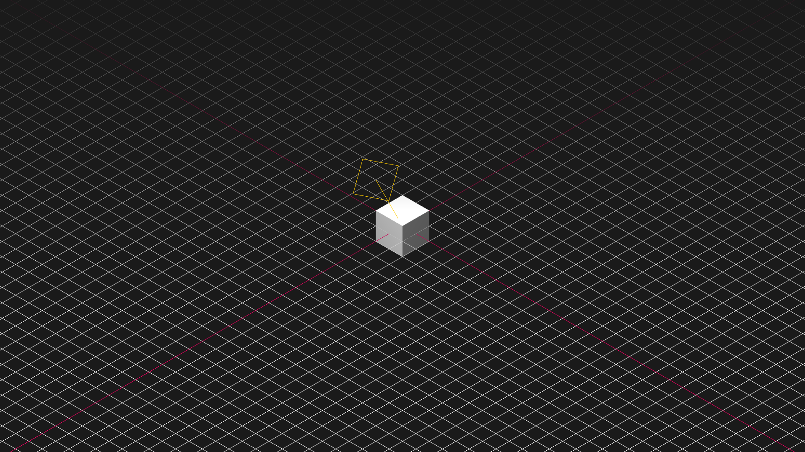

<h1 align="center">ThreeJs Default Template</h1>

A simple scene with all the boring thing you don't want to do yourself

 
<h2>Usage</h2>

Just clone this repository and change the things you want for your project, there are 2 cameras, grid and light helpers, renderer and it's all resizable.

 
<!-- <h3 align="center"></h3> -->
<h3 align="center"></h3>
